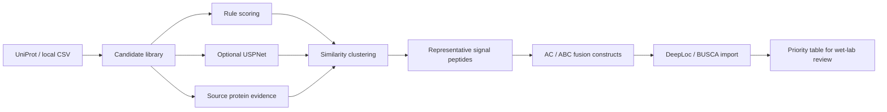
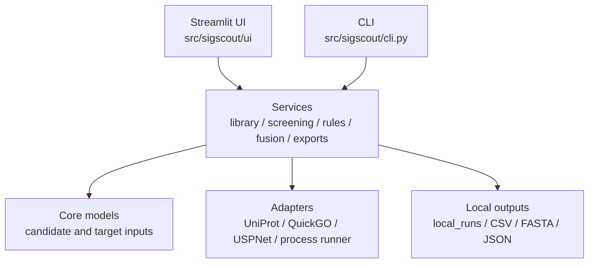

<div align="center">

# SigScout

**Signal peptide screening and fusion-construct preparation workbench for Pichia secretion design**

[](https://www.python.org/)
[](https://streamlit.io/)
[](https://pandas.pydata.org/)
[](https://docs.pydantic.dev/)

**Language:** [Chinese](README.md) | English

</div>

---

## Overview

SigScout is a protein-level signal peptide workbench for secretion-expression target proteins. It helps discover, interpret, screen, cluster, and export candidate signal peptides before wet-lab validation.

SigScout does not predict real secretion efficiency. Its role is to narrow the candidate space, preserve reviewable evidence, and prepare structured inputs for downstream codon optimization, fusion-construct design, and localization-risk review.

## What It Does

| Module | Current capability |
|---|---|
| Candidate discovery | Query UniProt for proteins with `signal peptide` features and import local CSV candidates |
| Rule scoring | Check N-region positive charge, H-region hydrophobic core, C-region cleavage preference, and low-complexity risks |
| USPNet review | Optionally call local USPNet-fast; missing USPNet does not block rule-based screening |
| Source-protein evidence | Use structured UniProt localization, GO cellular component terms, feature evidence codes, and optional QuickGO/GOA evidence |
| Similarity clustering | Group highly similar signal peptides, export representatives, and preserve full duplicate/source evidence |
| Fusion constructs | Generate AC / ABC fusion proteins, construct indexes, positive leader controls, and processing-risk fields |
| Localization import | Merge DeepLoc 2.1 or BUSCA CSV/TSV outputs back into construct priority tables |
| Exports | Write CSV, FASTA, and JSON summaries for wet-lab discussion or downstream tools |

## Workflow



Typical downstream use:

1. Select representative signal peptides with SigScout.
2. Generate target-protein fusion constructs.
3. Review localization risks with external tools.
4. Export selected amino-acid sequences to CDS-level tools such as PichiaCLM.
5. Feed wet-lab results back into candidate prioritization.

## Architecture



| Layer | Key path | Responsibility |
|---|---|---|
| UI | [`src/sigscout/ui/streamlit_app.py`](src/sigscout/ui/streamlit_app.py) | Local workbench for screening, source annotation, representative browsing, fusion generation, and localization import |
| CLI | [`src/sigscout/cli.py`](src/sigscout/cli.py) | Scriptable discovery, screening, annotation, and app launch |
| Core | [`src/sigscout/core/`](src/sigscout/core/) | Candidate records, target inputs, sequence cleaning, and path discovery |
| Services | [`src/sigscout/services/`](src/sigscout/services/) | Candidate library, rule scoring, USPNet merge, clustering, source-route annotation, fusion constructs, and exports |
| Adapters | [`src/sigscout/adapters/`](src/sigscout/adapters/) | UniProt, QuickGO/GOA, USPNet, and local process integration |
| Tests | [`tests/`](tests/) | Focused checks for rules, library import, screening, source annotation, USPNet, and fusion constructs |

## Quick Start

Install in editable mode:

```powershell
cd C:\Users\63097\Documents\CursorProject\SigScout
python -m venv .venv
.\.venv\Scripts\Activate.ps1
python -m pip install -U pip
python -m pip install -e ".[test]"
```

Start the Streamlit workbench:

```powershell
python -m streamlit run src/sigscout/ui/streamlit_app.py --server.address 0.0.0.0 --server.port 8506
```

Or use the CLI:

```powershell
python -m sigscout.cli serve --port 8506
python -m sigscout.cli discover --taxon-id 4922 --max-records 300
python -m sigscout.cli screen --taxon-id 4922 --max-records 300
python -m sigscout.cli annotate-source --quickgo
```

## Outputs

Standard screening outputs:

| File | Purpose |
|---|---|
| `uniprot_candidates.csv` | Raw UniProt-derived candidates |
| `uniprot_duplicate_candidates.csv` | Duplicate or near-duplicate source evidence |
| `signal_peptide_method_comparison.csv` | Rule/USPNet/source-evidence merged candidate table |
| `signal_peptide_representatives.csv` | Representative sequence groups |
| `method_recommended_candidates.fasta` | Recommended candidates in FASTA format |
| `method_representative_candidates.fasta` | Representative candidates in FASTA format |
| `signal_peptide_method_comparison_summary.json` | Run summary |

Fusion outputs include AC / ABC construct FASTA, construct-index CSV, optional control leader rows, processing notes, localization import fields, risk flags, and priority scores.

## Boundaries

- SigScout does not run pcSec model comparison.
- SigScout does not perform codon optimization.
- SigScout does not integrate or download SignalP 6.0.
- USPNet-fast is optional and must be installed locally by the user if needed.
- DeepLoc and BUSCA are not called automatically; export their web-service results manually and import CSV/TSV files back into SigScout.
- The output is an experiment-discussion candidate set, not a final synthesis-ready guarantee.
- Real secretion performance must be validated with the actual strain, vector, cultivation condition, and assay.

## Data And Compliance Notes

- Keep UniProt accessions, query conditions, database provenance, and query dates in external materials.
- Preserve QuickGO/GOA GO IDs, evidence codes, references, and query dates when using source-protein evidence.
- Place optional USPNet-fast under `external/USPNet/` or configure `USPNET_REPO` / `USPNET_MODEL_DIR`.
- Runtime outputs are written to `local_runs/` and ignored by Git.

## Tests

```powershell
python -m compileall src tests sigscout
python -m pytest -q
python -m sigscout.cli --help
```

Health check after launching Streamlit:

```powershell
Invoke-WebRequest -UseBasicParsing -Uri http://127.0.0.1:8506/_stcore/health
```

## Acknowledgements

SigScout uses and thanks:

- [UniProt](https://www.uniprot.org/) for protein sequences, signal peptide annotations, and accession provenance.
- [QuickGO / GOA](https://www.ebi.ac.uk/QuickGO/) for GO cellular component annotations and evidence codes.
- [USPNet](https://github.com/ml4bio/USPNet) as an optional signal peptide review tool.
- [Streamlit](https://streamlit.io/), [pandas](https://pandas.pydata.org/), [Pydantic](https://docs.pydantic.dev/), and [pytest](https://pytest.org/).

## License

This repository does not currently declare an open-source license. Add an explicit license and review third-party data/model terms before external reuse, publication, or commercial distribution.
