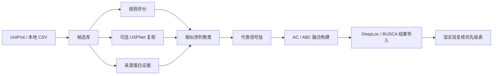
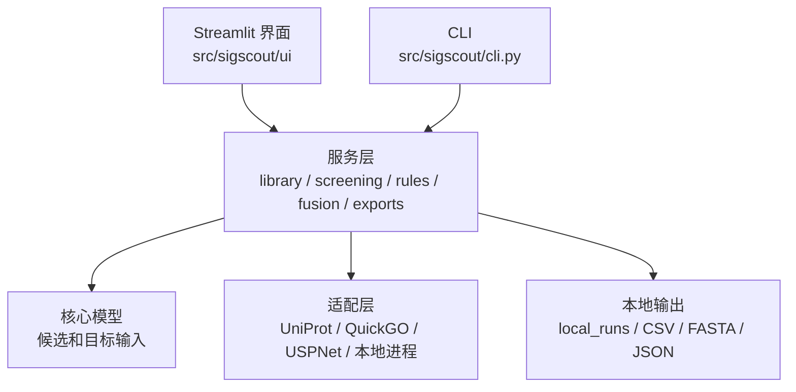

<div align="center">

# SigScout

**面向毕赤酵母分泌表达设计的信号肽筛选与融合构建工作台**

[](https://www.python.org/)
[](https://streamlit.io/)
[](https://pandas.pydata.org/)
[](https://docs.pydantic.dev/)

**语言：** 中文 | [英文](README.en.md)

</div>

---

## 项目定位

SigScout 是一个蛋白层面的信号肽工作台，用于为分泌表达目标蛋白筛选、解释、聚类和导出候选信号肽。

它的目标不是直接预测真实分泌效率，而是在湿实验前把候选范围缩小到可讨论、可审查、可复现的一批序列，并为后续密码子优化、融合构建和定位风险评估准备结构化输入。

## 功能概览

| 模块 | 当前能力 |
|---|---|
| 候选获取 | 从 UniProt 获取带 `signal peptide` 注释的候选，也支持本地 CSV 候选导入 |
| 规则评分 | 检查 N 区正电、H 区疏水核心、C 区切割位点和低复杂度风险 |
| USPNet 复核 | 可选调用本地 USPNet-fast；未安装时不阻断规则筛选 |
| 来源蛋白证据 | 基于 UniProt 结构化定位、GO cellular component、feature evidence code 和可选 QuickGO/GOA 证据判断来源蛋白路线 |
| 相似聚类 | 对高度相似的信号肽分组，输出代表序列，同时保留完整候选和重复证据 |
| 融合构建 | 生成 AC / ABC 融合蛋白序列、构建索引、阳性引导肽对照和基础加工风险扫描 |
| 定位结果导入 | 导入 DeepLoc 2.1 或 BUSCA 的 CSV/TSV 结果，合并到构建排序表 |
| 导出 | 输出 CSV、FASTA 和 JSON 摘要，用于实验讨论或下游工具衔接 |

## 工作流程



典型下游用法：

1. 用 SigScout 选择代表性信号肽。
2. 为目标蛋白生成融合构建。
3. 用外部定位工具补充定位风险复核。
4. 将选中的氨基酸序列导出到 PichiaCLM 等 CDS 层工具。
5. 将湿实验结果回填到候选优先级讨论中。

## 架构概览



| 层级 | 关键路径 | 职责 |
|---|---|---|
| 界面层 | [`src/sigscout/ui/streamlit_app.py`](src/sigscout/ui/streamlit_app.py) | 本地工作台，负责筛选、来源注释、代表序列浏览、融合构建和定位结果导入 |
| CLI | [`src/sigscout/cli.py`](src/sigscout/cli.py) | 可脚本化的发现、筛选、注释和页面启动入口 |
| 核心层 | [`src/sigscout/core/`](src/sigscout/core/) | 候选记录、目标输入、序列清洗和路径发现 |
| 服务层 | [`src/sigscout/services/`](src/sigscout/services/) | 候选库、规则评分、USPNet 合并、聚类、来源路线注释、融合构建和导出 |
| 适配层 | [`src/sigscout/adapters/`](src/sigscout/adapters/) | UniProt、QuickGO/GOA、USPNet 和本地进程集成 |
| 测试 | [`tests/`](tests/) | 规则、候选库导入、筛选、来源注释、USPNet 和融合构建的局部测试 |

## 快速开始

以可编辑模式安装：

```powershell
cd C:\Users\63097\Documents\CursorProject\SigScout
python -m venv .venv
.\.venv\Scripts\Activate.ps1
python -m pip install -U pip
python -m pip install -e ".[test]"
```

启动 Streamlit 工作台：

```powershell
python -m streamlit run src/sigscout/ui/streamlit_app.py --server.address 0.0.0.0 --server.port 8506
```

也可以使用 CLI：

```powershell
python -m sigscout.cli serve --port 8506
python -m sigscout.cli discover --taxon-id 4922 --max-records 300
python -m sigscout.cli screen --taxon-id 4922 --max-records 300
python -m sigscout.cli annotate-source --quickgo
```

## 输出文件

标准筛选输出：

| 文件 | 用途 |
|---|---|
| `uniprot_candidates.csv` | UniProt 原始候选 |
| `uniprot_duplicate_candidates.csv` | 重复或近似重复的来源证据 |
| `signal_peptide_method_comparison.csv` | 规则、USPNet 和来源证据合并后的候选表 |
| `signal_peptide_representatives.csv` | 代表序列分组 |
| `method_recommended_candidates.fasta` | 推荐候选 FASTA |
| `method_representative_candidates.fasta` | 代表候选 FASTA |
| `signal_peptide_method_comparison_summary.json` | 运行摘要 |

融合构建输出包括 AC / ABC 构建 FASTA、构建索引 CSV、可选对照引导肽记录、加工说明、定位结果导入字段、风险标记和优先级评分。

## 使用边界

- SigScout 不运行 pcSec 模型比较。
- SigScout 不执行密码子优化。
- SigScout 不集成或下载 SignalP 6.0。
- USPNet-fast 是可选组件；如需使用，需要用户在本地自行安装。
- DeepLoc 和 BUSCA 不会自动调用；需要手动导出网页服务结果，再将 CSV/TSV 文件导入 SigScout。
- 输出结果是用于实验讨论的候选集合，不是可直接合成的最终保证。
- 真实分泌表现必须在实际菌株、载体、培养条件和检测方法中验证。

## 数据与合规说明

- 在外部材料中保留 UniProt accession、查询条件、数据库来源和查询日期。
- 使用来源蛋白证据时，保留 QuickGO/GOA 的 GO ID、证据代码、参考文献和查询日期。
- 可选 USPNet-fast 可放在 `external/USPNet/`，或通过 `USPNET_REPO` / `USPNET_MODEL_DIR` 配置。
- 运行输出写入 `local_runs/`，并由 Git 忽略。

## 测试

```powershell
python -m compileall src tests sigscout
python -m pytest -q
python -m sigscout.cli --help
```

启动 Streamlit 后的健康检查：

```powershell
Invoke-WebRequest -UseBasicParsing -Uri http://127.0.0.1:8506/_stcore/health
```

## 致谢

SigScout 使用并感谢：

- [UniProt](https://www.uniprot.org/) 提供蛋白序列、信号肽注释和 accession 来源信息。
- [QuickGO / GOA](https://www.ebi.ac.uk/QuickGO/) 提供 GO 细胞组分注释和证据代码。
- [USPNet](https://github.com/ml4bio/USPNet) 作为可选信号肽复核工具。
- [Streamlit](https://streamlit.io/)、[pandas](https://pandas.pydata.org/)、[Pydantic](https://docs.pydantic.dev/) 和 [pytest](https://pytest.org/) 提供应用、数据建模和测试支持。

## 许可证

当前仓库尚未声明开源许可证。对外复用、发布或商业分发前，应先补充明确许可证，并复核第三方数据和模型条款。
