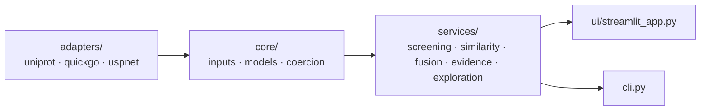
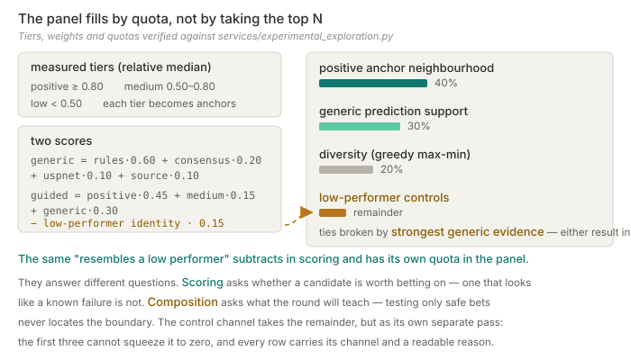

<div align="center">

# SigScout

### Which signal peptides to test next — including the ones expected to fail.


[](#tech-stack)
[](#why-not-signalp)
[](docs/adr/006-guided-exploration-not-yield-model.md)
[](tests)

[Why not SignalP](#why-not-signalp) · [Architecture](#architecture) · [The panel](#the-guided-exploration-panel) · [Quick start](#quick-start) · [Tech stack](#tech-stack) · [Boundaries](#boundaries)

[**English**](README.md) · [中文](README.zh.md)

</div>

---

> Finds, explains and clusters signal-peptide candidates for secretion constructs, then uses wet-lab
> feedback to narrow the next round — **transparently**, without pretending to be a yield model.

Split out of the secretion-model project ([its ADR-010](https://github.com/77652189/pcSecYeastSpecies))
once signal-peptide work stopped fitting there.

## Why not SignalP

The field's best-known predictor **forbids commercial use**. For a project meant to serve
production that is not a tooling question — it decides where candidates come from at all.

So the sourcing was rebuilt: UniProt-verified natural signal peptides (real sequences with
annotation support, not generated ones), QuickGO for source-protein evidence, and USPNet — a
commercially usable open-source predictor — as an independent re-check.

That constraint shaped the product. With no single strong predictor to lean on, ranking has to rest
on **several independent lines of evidence, each kept individually visible**: a rules score,
consensus, the independent prediction, and source-protein evidence each contribute a share, and
none of them disappears into a total.

## Architecture


```mermaid
flowchart LR
  SRC["adapters/<br/>uniprot · quickgo · uspnet"] --> CORE["core/<br/>inputs · models · coercion"]
  CORE --> SVC["services/<br/>screening · similarity · fusion · evidence · exploration"]
  SVC --> UI["ui/streamlit_app.py"]
  SVC --> CLI["cli.py"]
```

Streamlit and CLI are two entry points onto the same services — a candidate ranked in one is
ranked identically in the other.

## What it does

- Fetch candidates from remote sources or local CSV, **keeping duplicates and their evidence**
  rather than silently deduplicating away the fact that two sources agreed
- Filter with explainable rules, optional local prediction re-checks, and source-protein evidence
- Cluster similar signal peptides, keeping every candidate and emitting a representative sequence
- Generate fusion constructs; export CSV, FASTA and JSON summaries
- Import wet-lab measurements and produce a next-round exploration panel

## The guided exploration panel



Measured candidates are split into tiers by relative median — positive at ≥ 0.80, medium between
0.50 and 0.80, low below 0.50 — and each tier becomes a set of anchors. Untested candidates are
scored on their nearest-anchor similarity (normalised Levenshtein) plus evidence that does not
depend on feedback at all.

**The panel is then filled by quota across four channels, not by taking the top N.** Positive
neighbourhood takes 40%, generic support 30%, diversity 20%, and low-performer controls the
remainder.

The part worth pausing on: **similarity to a known low performer subtracts from a candidate's
guided score, and the fourth channel selects exactly those candidates.** Both are correct, because
they answer different questions. Scoring asks *is this worth betting on* — something resembling a
known failure is not. Composition asks *what will this round teach* — and a panel holding only safe
bets never locates the boundary it exists to find. As
[ADR-006](docs/adr/006-guided-exploration-not-yield-model.md) puts it, a panel of only the
best-so-far has stopped being exploration.

The control channel takes the remainder but runs as its own separate pass, so the first three
cannot squeeze it to zero. Diversity is a greedy max-min selection that recomputes every remaining
candidate's similarity to the current panel after each pick. And every selected row carries the
channel that admitted it plus a human-readable reason naming the anchor and the similarity — the
panel is reviewable without reading the code.

**With no feedback there is no panel.** If nothing is measured, or nothing is untested, the
function returns empty rather than falling back to a generic ranking. Guided exploration without
feedback is not a degraded version of itself.

## Quick start

```bash
git clone https://github.com/77652189/SigScout.git
cd SigScout
pip install -e .
```

```powershell
python -m streamlit run src/sigscout/ui/streamlit_app.py
```

```bash
sigscout --help              # console entry point, same services
pip install -e ".[test]" && python -m pytest    # 77 tests
```

## Tech stack

| Layer | Choice | Why this one |
| --- | --- | --- |
| Runtime dependencies | **`streamlit`, `pandas`, `pydantic` — three** | Screening, clustering and exploration are standard library plus dataframes; the sequence identity metric is a hand-written Levenshtein rather than a bioinformatics dependency, so the analysis layer installs anywhere |
| Candidate sources | UniProt · QuickGO · USPNet | Verified natural sequences and commercially usable tools — see [above](#why-not-signalp) |
| Contracts | Pydantic | Typed inputs at the adapter boundary, so a source change surfaces as a validation error rather than a downstream `KeyError` |
| Entry points | Streamlit + console script | Two front ends, one service layer, identical verdicts |
| Localization | **External tool, run by a human** | No automatic calls to external web tools and no automatic download of licence-restricted resources; results are exported as FASTA and imported back |
| Tests | pytest | 77 tests; the handoff also records that page-level smoke tests do not replace an interactive walkthrough |

## Engineering decisions

**Guided exploration is a candidate-compression tool, not a yield model**
([ADR-006](docs/adr/006-guided-exploration-not-yield-model.md)). It is allowed to say "these are
worth trying next"; it is not allowed to imply predicted titre, cross-batch comparability, or
statistical significance.

**Experimental feedback is keyed by exact sequence and stays out of the localization score**
([ADR-005](docs/adr/005-experimental-evidence-boundary.md)). Similar sequence ≠ validated
candidate, and feedback from one target never propagates to another. Changing the B or C segment,
or the construct type, **downgrades** the evidence. Merging feedback into the external localization
tool's score would produce one number whose meaning nobody could state — so the two sit side by
side instead, and the reader interprets them separately.

**The shared candidate library stays target-agnostic**
([ADR-004](docs/adr/004-shared-library-target-overlays.md)). Target-specific differences live in
isolated overlays, so a second target cannot quietly rewrite the first target's library.

**Source-protein assessment runs separately from candidate refresh**
([ADR-007](docs/adr/007-source-annotation-lifecycle.md)), and refresh preserves completed
annotations — otherwise every refresh would penalise whoever had already done the manual work.

**Tracked documents use target de-identification**
([ADR-001](docs/adr/001-confidential-document-scope.md)) — committed material carries
mechanism-level abstraction only.

## Boundaries

- **No yield prediction**, no cross-batch comparability, no significance claims.
- **Short signal peptides and full leaders are never mixed** in guided-exploration scoring.
- **No automatic calls to external web localization tools**, and no automatic download or
  submission of licence-restricted model resources.
- **Duplicates are kept, not merged.** Two sources agreeing is evidence, and deduplication would
  erase it.
- Source-protein assessment runs **separately from** candidate refresh
  ([ADR-007](docs/adr/007-source-annotation-lifecycle.md)).

## Documentation

| Document | Changes when |
| --- | --- |
| [Requirements](docs/REQUIREMENTS.md) | the goal or capability boundary changes |
| [Architecture](docs/ARCHITECTURE.md) | the implementation structure changes |
| [Execution plan](docs/EXECUTION_PLAN.md) | progress moves — sole authority on status |
| [Handoff](docs/HANDOFF.md) | the active slice changes |
| [ADR index](docs/adr/README.md) | never — decisions are superseded, not edited |

---

<div align="center">

More work at [my personal site](https://77652189.github.io).

</div>
