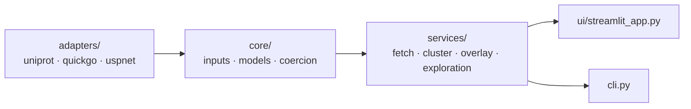

# SigScout — Signal Peptide Discovery & Guided Exploration

[English](README.md) · [中文](README.zh.md)

> Finds, explains and clusters signal-peptide candidates for secretion constructs, then uses wet-lab
> feedback to narrow the next round — **transparently**, without pretending to be a yield model.

Split out of the secretion-model project ([its ADR-010](https://github.com/77652189/pcSecYeastSpecies))
once signal-peptide work stopped fitting there. SignalP is not used: its licence bars commercial
use. Candidates come from UniProt-verified natural signal peptides plus commercially usable
open-source tools.

---

## Architecture


```mermaid
flowchart LR
  SRC["adapters/<br/>uniprot · quickgo · uspnet"] --> CORE["core/<br/>inputs · models · coercion"]
  CORE --> SVC["services/<br/>fetch · cluster · overlay · exploration"]
  SVC --> UI["ui/streamlit_app.py"]
  SVC --> CLI["cli.py"]
```

Streamlit and CLI are two entry points onto the same services — a candidate ranked in one is
ranked identically in the other.

## What it does

- Fetch candidates from remote sources or local CSV, **keeping duplicates and their evidence**
  rather than silently deduplicating away the fact that two sources agreed
- Filter with explainable rules, optional local prediction re-checks, and source-protein evidence
- Cluster similar signal peptides, keeping every candidate and emitting a representative sequence
- Generate fusion constructs; export CSV, FASTA and JSON summaries
- Import wet-lab measurements and produce a next-round exploration panel containing positive
  neighbourhoods, general support, diversity, and **low-performer controls**

## Quick start

```powershell
python -m streamlit run src/sigscout/ui/streamlit_app.py
```

## Engineering decisions

**Guided exploration is a candidate-compression tool, not a yield model**
([ADR-006](docs/adr/006-guided-exploration-not-yield-model.md)). It is allowed to say "these are
worth trying next"; it is not allowed to imply predicted titre, cross-batch comparability, or
statistical significance. The panel deliberately includes low performers — a panel of only the
best-so-far stops being exploration.

**Experimental feedback is keyed by exact sequence and stays out of the localization score**
([ADR-005](docs/adr/005-experimental-evidence-boundary.md)). Similar sequence ≠ validated
candidate, and feedback from one target never propagates to another. Merging feedback into the
external localization tool's score would produce one uninterpretable total — so it does not happen.

**The shared candidate library stays target-agnostic**
([ADR-004](docs/adr/004-shared-library-target-overlays.md)). Target-specific differences live in
isolated overlays, so a second target cannot quietly rewrite the first target's library.

**Tracked documents use target de-identification**
([ADR-001](docs/adr/001-confidential-document-scope.md)) — committed material carries
mechanism-level abstraction only.

## Boundaries

- **No yield prediction**, no cross-batch comparability, no significance claims.
- **Short signal peptides and full leaders are never mixed** in guided-exploration scoring.
- **No automatic calls to external web localization tools**, and no automatic download or
  submission of licence-restricted model resources.
- Source-protein assessment runs **separately from** candidate refresh, and refresh preserves
  completed annotations ([ADR-007](docs/adr/007-source-annotation-lifecycle.md)).

## Documentation

| Document | Changes when |
| --- | --- |
| [Requirements](docs/REQUIREMENTS.md) | the goal or capability boundary changes |
| [Architecture](docs/ARCHITECTURE.md) | the implementation structure changes |
| [Execution plan](docs/EXECUTION_PLAN.md) | progress moves — sole authority on status |
| [Handoff](docs/HANDOFF.md) | the active slice changes |
| [ADR index](docs/adr/README.md) | never — decisions are superseded, not edited |

---

> More work at [my personal site](https://77652189.github.io).
