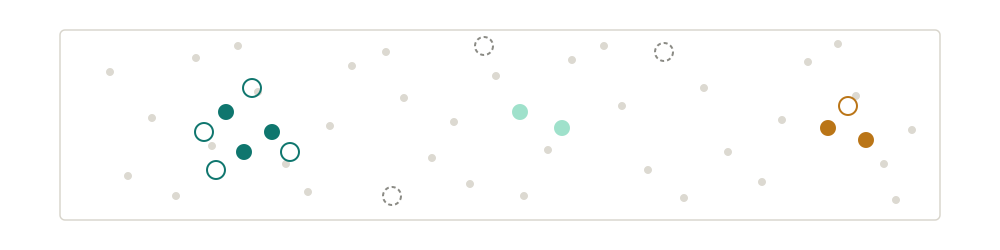
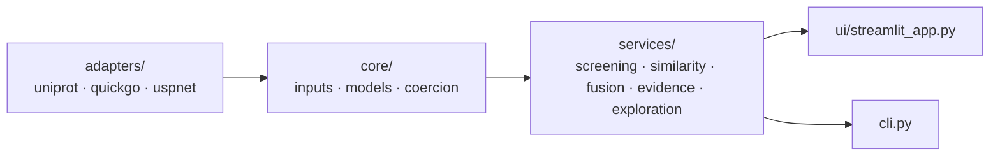
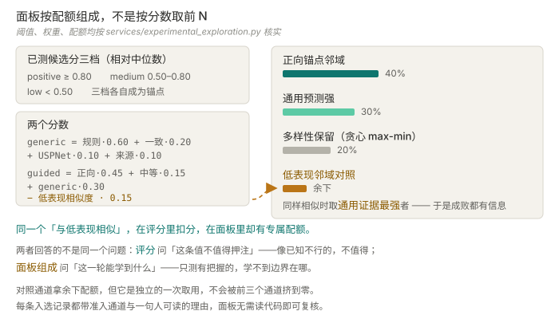

<div align="center">

# SigScout

### 下一轮该测哪些信号肽 —— 包括那些预期会失败的。




[](#技术栈)
[](#为什么不用-signalp)
[](docs/adr/006-guided-exploration-not-yield-model.md)
[](tests)

[为什么不用 SignalP](#为什么不用-signalp) · [架构](#架构) · [探索面板](#引导探索面板) · [快速开始](#快速开始) · [技术栈](#技术栈) · [边界](#边界)

[English](README.md) · [**中文**](README.zh.md)

</div>

---

> 为分泌构建寻找、解释、聚类信号肽候选，再用湿实验反馈收窄下一轮——
> **透明地做**，并且**不假装自己是产量模型**。

从分泌通路模型项目拆出（[对方的 ADR-010](https://github.com/77652189/pcSecYeastSpecies)），
因为信号肽这条线在那边越做越不合身。

## 为什么不用 SignalP

该领域最知名的预测器**禁止商用**。对一个要服务生产的项目来说，这不是"换个工具"的问题——
它决定了**候选到底从哪来**。

于是来源被整体重建：UniProt 已验证的天然信号肽（有注释支持的真实序列，不是模型生成的）、
QuickGO 提供来源蛋白证据、以及可商用的开源预测器 USPNet 做独立复核。

这条约束塑造了产品形态。既然没有一个强预测器可以依赖，排序就必须建立在
**多路独立证据、且每一路都保持单独可见**之上：规则分、一致性、独立预测、来源蛋白证据
各占一份权重，**没有哪一路会消失在一个总分里**。

## 架构



Streamlit 与 CLI 是同一套 services 的两个入口——在一个里排到某个名次的候选，
在另一个里名次相同。

## 它做什么

- 从远程来源或本地 CSV 获取候选，**保留重复及其证据**，
  而不是把"两个来源都给出了同一条"这件事静默去重掉
- 用可解释规则过滤，可选本地预测复核，叠加来源蛋白证据
- 聚类相似信号肽，**保留每一条候选**并另出一条代表序列
- 生成融合构建；导出 CSV、FASTA、JSON
- 导入湿实验测量，产出下一轮探索面板

## 引导探索面板



已测候选按相对中位数分档——positive ≥ 0.80、medium 0.50–0.80、low < 0.50——
每档各自成为锚点。未测候选按与最近锚点的相似度（归一化 Levenshtein）打分，
再叠加一部分**完全不依赖反馈**的证据。

**然后面板按四个通道的配额填充，而不是取分数前 N。**
正向锚点邻域占 40%、通用预测强 30%、多样性保留 20%、低表现对照拿余下。

值得停下来看的是：**与已知低表现序列相似会从引导分里扣分，而第四个通道恰恰挑选这些候选。**
两者都对，因为它们回答的不是同一个问题。评分问*这条值不值得押注*——像已知不行的，不值得；
组成问*这一轮能学到什么*——而一个只装有把握候选的面板，永远定位不出它本该找到的边界。
[ADR-006](docs/adr/006-guided-exploration-not-yield-model.md) 的说法是：
**一个只装当前最好者的面板，已经不是探索了。**

对照通道拿余下配额，但它是**独立的一次取用**，前三个通道挤不掉它。
多样性通道是贪心 max-min：每选一条就重算所有剩余候选对当前面板的最大相似度。
而每条入选记录都带**准入通道**和**一句人可读的理由**（指明锚点与相似度）——
面板无需读代码即可复核。

**没有反馈就没有面板。** 若没有已测数据、或没有未测候选，函数直接返回空，
而不是退回到通用排序。**缺少反馈的引导探索，不是它自己的降级版本。**

## 快速开始

```bash
git clone https://github.com/77652189/SigScout.git
cd SigScout
pip install -e .
```

```powershell
python -m streamlit run src/sigscout/ui/streamlit_app.py
```

```bash
sigscout --help              # 控制台入口，同一套 services
pip install -e ".[test]" && python -m pytest    # 77 个测试
```

## 技术栈

| 层 | 选型 | 为什么是它 |
| --- | --- | --- |
| 运行时依赖 | **`streamlit`、`pandas`、`pydantic` —— 三个** | 筛查、聚类、探索全部建立在标准库加 dataframe 上；序列相似度是**手写的 Levenshtein** 而不是一个生信依赖，因此分析层在任何环境都装得上 |
| 候选来源 | UniProt · QuickGO · USPNet | 已验证天然序列 + 可商用工具，理由见[上文](#为什么不用-signalp) |
| 契约 | Pydantic | adapter 边界上的带类型输入——来源变化会表现为**校验错误**，而不是下游某处的 `KeyError` |
| 入口 | Streamlit + 控制台脚本 | 两个前端、一套服务层、判定一致 |
| 定位工具 | **外部工具，人工运行** | 禁止自动调用外部网页工具、禁止自动下载受许可限制的资源；结果以 FASTA 导出、再导回 |
| 测试 | pytest | 77 个测试；handoff 里另记了一条：**页面级冒烟测试不能替代交互走查** |

## 工程决策

**引导探索是候选压缩工具，不是产量模型**
（[ADR-006](docs/adr/006-guided-exploration-not-yield-model.md)）。
它可以说"这些值得下轮试"；**不可以**暗示预测效价、跨批可比性或统计显著性。

**实验反馈按精确序列关联，且不进入定位评分**
（[ADR-005](docs/adr/005-experimental-evidence-boundary.md)）。
相似序列 ≠ 已验证候选，一个目标的反馈永远不传播到另一个目标。
改动 B 段、C 段或构建类型会让证据**降级**。
把反馈合进外部定位工具的评分，会产出一个**没人说得清含义的数**——
所以两者并列显示，由人分别解读。

**共享候选库与目标无关**（[ADR-004](docs/adr/004-shared-library-target-overlays.md)）。
目标特定的差异住在隔离的 overlay 里，**第二个目标不会悄悄改写第一个目标的库**。

**来源蛋白评估与候选刷新分离**
（[ADR-007](docs/adr/007-source-annotation-lifecycle.md)），且刷新**保留已完成的注释**——
否则每次刷新都在惩罚已经做过人工判断的人。

**入库文档做目标去标识化**
（[ADR-001](docs/adr/001-confidential-document-scope.md)）——提交进版本库的材料只含机制层抽象。

## 边界

- **不预测产量**，不做跨批可比，不声称统计显著性。
- **短信号肽与完整 leader 在引导探索评分中永不混用。**
- **不自动调用外部网页定位工具**，不自动下载或提交受许可限制的模型资源。
- **重复保留，不合并。** 两个来源都给出同一条是证据，去重会把它抹掉。
- 来源蛋白评估与候选刷新**分离运行**
  （[ADR-007](docs/adr/007-source-annotation-lifecycle.md)）。

## 文档

| 文档 | 什么时候改 |
| --- | --- |
| [需求](docs/REQUIREMENTS.md) | 目标或能力边界变了 |
| [架构](docs/ARCHITECTURE.md) | 实现结构变了 |
| [执行计划](docs/EXECUTION_PLAN.md) | 进度推进了——状态的唯一权威 |
| [handoff](docs/HANDOFF.md) | 当前切片换了 |
| [ADR 索引](docs/adr/README.md) | 从不改——决策只被取代，不被改写 |

---

<div align="center">

更多项目见[个人网站](https://77652189.github.io)。

</div>
