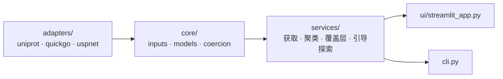

# SigScout 信号肽发现与实验引导探索

[English](README.md) · [中文](README.zh.md)

> 为分泌表达构建发现、解释、聚类信号肽候选，再用湿实验反馈收窄下一轮——
> **过程透明**，且不假装自己是产量模型。

从分泌模型项目里拆出来（对应那边的 ADR-010），因为信号肽的工作放在那里已经不合适。
不使用 SignalP：它的许可禁止商用。候选来自 UniProt 已验证的天然信号肽，
外加可商用的开源工具。

---

## 架构



Streamlit 与 CLI 是同一套 services 的两个入口——
在一个里排第几，在另一个里就是第几。

## 实现了什么

- 从远程来源或本地 CSV 获取候选，**保留重复项及其证据**——
  两个来源都给出同一条，这个事实本身是信息，静默去重就把它扔了
- 用可解释的规则、可选的本地预测复核、来源蛋白证据做筛选
- 聚类相似信号肽，保留全部候选并输出代表序列
- 生成融合构建；导出 CSV、FASTA 与 JSON 摘要
- 导入湿实验测量，产出下一轮探索面板：正向邻域、通用支持、多样性，
  以及**低表现对照**

## 快速开始

```powershell
python -m streamlit run src/sigscout/ui/streamlit_app.py
```

## 工程要点

**引导探索是候选压缩工具，不是产量模型**
（[ADR-006](docs/adr/006-guided-exploration-not-yield-model.md)）。
它可以说"这几条值得下一轮试"；不可以暗示预测产量、跨批次可比或统计显著性。
面板里刻意留了低表现对照——只装当前最好的那批，就不再是探索了。

**实验反馈按精确序列关联，且不并入定位评分**
（[ADR-005](docs/adr/005-experimental-evidence-boundary.md)）。
序列相似 ≠ 候选已验证，一个目标的反馈永不传播到另一个目标。
把反馈揉进外部定位工具的分数里，会得到一个没法解释的总分——所以不做。

**共享候选库保持目标无关**
（[ADR-004](docs/adr/004-shared-library-target-overlays.md)）。
目标特异的差异走隔离覆盖层，第二个目标没法悄悄改写第一个目标的库。

**受跟踪文档采用目标脱敏边界**
（[ADR-001](docs/adr/001-confidential-document-scope.md)）——提交进仓库的只有机制层抽象。

## 边界

- **不预测产量**，不声称跨批次可比，不声称统计显著性。
- **短信号肽与完整 leader 在引导评分中绝不混比。**
- **不自动调用外部网页定位工具**，不自动下载或提交受许可限制的模型资源。
- 来源蛋白评估与候选刷新**分开执行**，刷新时保留已完成的注释
  （[ADR-007](docs/adr/007-source-annotation-lifecycle.md)）。

## 文档

| 文档 | 什么时候改 |
| --- | --- |
| [需求](docs/REQUIREMENTS.md) | 目标或能力边界变了 |
| [架构](docs/ARCHITECTURE.md) | 实现结构变了 |
| [执行计划](docs/EXECUTION_PLAN.md) | 进度推进了——状态的唯一权威 |
| [handoff](docs/HANDOFF.md) | 当前切片换了 |
| [ADR 索引](docs/adr/README.md) | 从不改——决策只被取代，不被改写 |

---

> 更多项目见[个人网站](https://77652189.github.io)。
