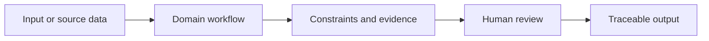
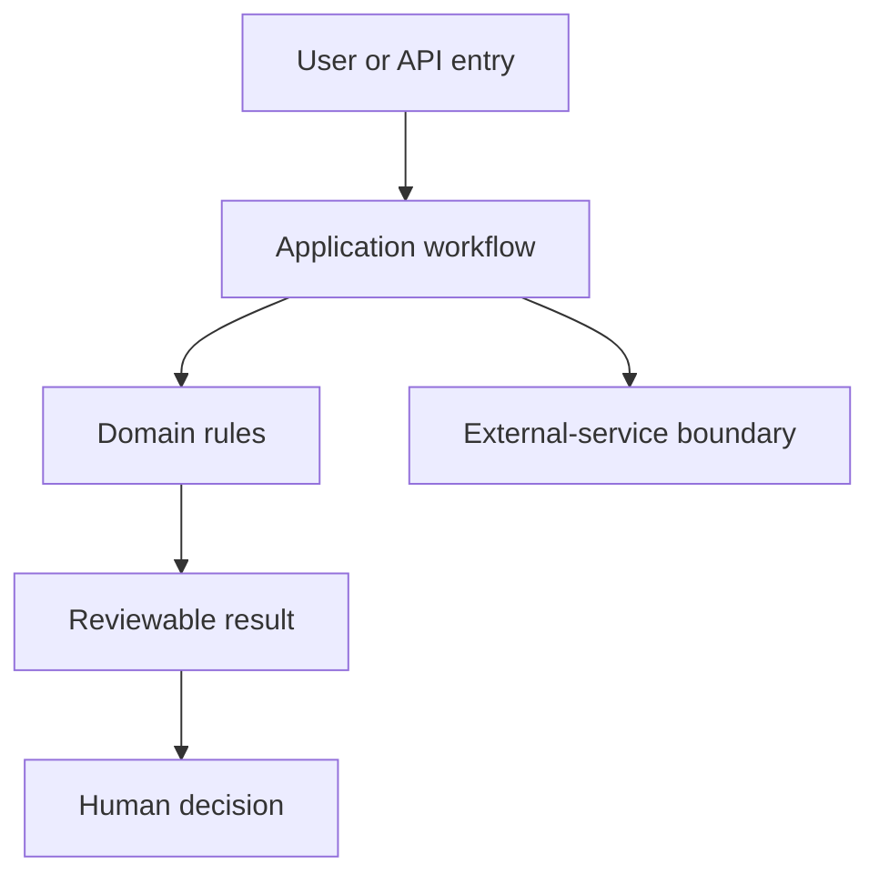

# SigScout 信号肽探索工作台

[English](README.md) · [中文](README.zh.md)

> **用于分泌构建的信号肽发现、筛选、聚类与实验引导探索。** It is built for reviewable decisions, not unqualified claims.

## 为什么重要

项目把高风险的科研或产品判断变得可检查：输入、约束、证据和最终人工决策都保持可见。

## 面试展示亮点

> **项目专属亮点：** 来源证据、目标隔离反馈和多样性保持分开，不被压缩为误导性的单一总分。

| Design choice | Value for an interviewer |
| --- | --- |
| Evidence before recommendation | Results retain source, constraint, and failure context |
| Human decision boundary | The system narrows choices; it does not authorize scientific, compliance, or deployment action |
| Explicit non-goals | Unsupported claims are documented rather than implied by a polished UI |
| Canon + tests | Requirements, architecture, status, handoff, and long-lived decisions remain separately reviewable |

## 工作流



## 架构边界



## 快速开始

按项目受支持的本地环境安装依赖后运行：

```powershell
python -m streamlit run src/sigscout/ui/streamlit_app.py --server.address 0.0.0.0 --server.port 8506
```

## 工程证据

| Checkpoint | Evidence | Boundary |
| --- | --- | --- |
| Product behavior | Run the focused tests named in Handoff | No output becomes a validated real-world outcome automatically |
| Documentation | Run the repository documentation guard | Current status belongs to the execution plan, not this README |
| Current direction | Read the execution plan before extending scope | No product slice is authorized; new sources or targets require explicit data and acceptance boundaries. |

## 权威项目文档

| Document | Use it for |
| --- | --- |
| [Requirements](docs/REQUIREMENTS.md) | Scope and capability boundary |
| [Architecture](docs/ARCHITECTURE.md) | Layer rules and protected boundaries |
| [Execution plan](docs/EXECUTION_PLAN.md) | Current authority, gates, and blockers |
| [Handoff](docs/HANDOFF.md) | Current slice and verification |
| [ADR index](docs/adr/README.md) | Long-lived decisions and alternatives |

<details>
<summary>技术面试视角</summary>

The strongest discussion point is not a framework name: it is the explicit boundary between evidence, computation, and the person who remains accountable for the final decision. Current status and blockers are intentionally linked rather than copied here.
</details>

> **项目思考：** 可靠的工具不隐藏不确定性，而是让下一步决策更经得起追问。更多项目见[个人网站](https://77652189.github.io)。
