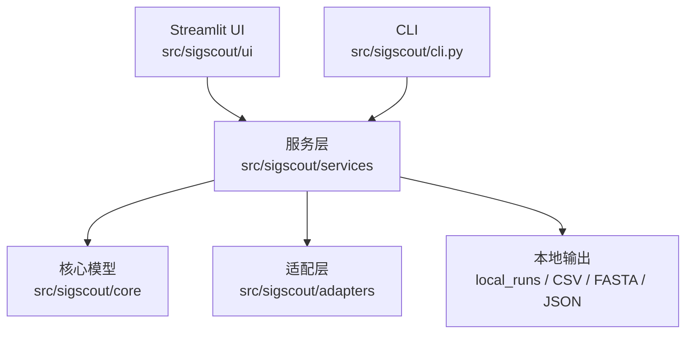

# SigScout 架构文档

维护说明：这份文档描述**当前代码的实际结构**（截至 2026-07-28，commit `a4f68a3`），不是理想状态。理想状态与差距见 [EXECUTION_PLAN.md](EXECUTION_PLAN.md)；变更历史见 [ARCHITECTURE_CHANGES.md](ARCHITECTURE_CHANGES.md)。行数/依赖数据来自 codebase-memory-mcp 图索引，若代码已变化，以实际代码为准。

## 1. 分层总览

**当前实际耦合比 README 画的更乱**：`UI --> SERVICES` 这条箭头在代码里是"`streamlit_app.py` 直接 `import` 5 个 service 子模块 + 1 个 adapter + `core.paths`"，绕过了 `services/__init__.py` 想要充当的统一入口——`services/__init__.py` 的 `__all__` 本身也没跟上实际用法（缺 `score_construct`、`FusionTargetPreset`/`FUSION_TARGET_PRESETS`、`DEFAULT_ALPHA_FACTOR_PRO_SEQUENCE`、experimental_feedback 的导出等）。这条不一致在 [EXECUTION_PLAN.md](EXECUTION_PLAN.md) Phase 5 里作为未决问题记录，还没有解决。

## 2. 入口层

- **CLI**（`src/sigscout/cli.py`，109 行）：`argparse` 四个子命令 `discover`/`screen`/`annotate-source`/`serve`；只依赖 `SignalPeptideLibraryService`、`SignalPeptideScreeningService`、`USPNetAdapter`——没有直接依赖 fusion/experimental 相关模块，是全代码库里耦合最干净的入口。
- **Streamlit UI**（`src/sigscout/ui/streamlit_app.py`，**1839 行，64 个函数，无 class**）：`main()` 用侧边栏 `radio` 做四路导航——"毕赤酵母信号肽筛选" / "代表序列与下载" / "融合定位" / "实验反馈"——分发给四个 `render_*` 顶层函数，每个顶层函数下面挂了一堆 `_render_*` 私有辅助（表格、卡片、分页、CSS、下载按钮等）。**这是全代码库最大的单文件，也是零自动化测试覆盖的部分**——现有 53 个测试没有一个 import `streamlit_app.py` 或 `experimental_browser.py`。
- **`ui/experimental_browser.py`**（322 行）：`render_opn_experimental_browser` 及其私有辅助，从 `streamlit_app.py` 的 `_render_candidate_browser` 里被调用，嵌入"代表序列与下载 → 候选浏览"页面，不是独立导航项。这个文件是目前 UI 层里**唯一**做到"从 `streamlit_app.py` 拆出去独立成文件"的例子，是 [EXECUTION_PLAN.md](EXECUTION_PLAN.md) Phase 1 拆分的参照样板。

## 3. 核心模型层（`src/sigscout/core/`）

小而稳定，不在重构范围内：

- `models.py`（71 行）：`SignalPeptideCandidate`（Pydantic，候选的规范表示：leader/signal peptide 序列、来源 UniProt 字段、分类标签）、`CandidateDiscoveryResult`、`UniProtCandidateLibraryResult`、`AA_PATTERN`（标准氨基酸单字母正则）。
- `inputs.py`（66 行）：`CandidateInputProvider`/`TargetProteinInputProvider` 两个 `Protocol`，`CandidateInputBatch`/`TargetProteinInput(Result)` 数据类，`clean_amino_acid_sequence`/`is_standard_amino_acid_sequence`。新增候选输入来源应该实现这两个 Protocol 之一，而不是让 UI 直接解析。
- `paths.py`（46 行）：`ProjectPaths.discover()` 向上找 `pyproject.toml` + `src/sigscout` 定位项目根；`local_runs_dir`、`uspnet_repo`（支持 `USPNET_REPO` 环境变量）等路径属性。**命名残留**：`opn_saved_screening_dir` 属性名仍然写死 `opn`，是早期单目标阶段的命名，没有跟随后续多目标化重构更新。
- `coercion.py`（47 行，[EXECUTION_PLAN.md](EXECUTION_PLAN.md) Phase 0 新增）：`truthy`/`safe_int`/`safe_int_from_float`/`safe_float`/`now_iso`/`json_dumps`/`list_values`——原本分散在 7 个文件里的重复小工具函数收敛处。`safe_int` 和 `safe_int_from_float` 是两个不同函数（严格/宽松两种数字解析行为），不要当成同一个函数的两种写法。

## 4. 服务层（`src/sigscout/services/`）—— 主要复杂度集中在这里

| 文件 | 行数 | 职责 | 备注 |
|---|---|---|---|
| `library.py` | 192 | `SignalPeptideLibraryService`：候选库管理、CSV 导入校验（`validate_import_csv`）、模板 CSV 生成、委托 UniProt 发现 | 单一职责，清晰 |
| `inputs.py` | 198 | `CsvCandidateInputProvider`/`StaticCandidateInputProvider`/`StaticTargetProteinInputProvider`：`core/inputs.py` Protocol 的具体实现 | 清晰 |
| `rules.py` | 159 | `score_signal_peptide`：N 区正电/H 区疏水核心/C 区切割位点/低复杂度风险显式规则打分 | 清晰，最大函数 76 行 |
| `screening.py` | **884** | `SignalPeptideScreeningService`：UniProt 发现+持久化、规则评分合并、USPNet 合并、相似聚类（`cluster_similar_signal_peptides`/`choose_representative`/`signal_peptide_identity`/`_levenshtein_distance`）、来源蛋白注释合并、跨刷新保留已完成注释（`_merge_preserved_source_annotations`） | **全代码库最大文件**。`screen_uniprot_candidates` 单方法 **160 行**，in-degree 7（CLI/UI/测试都调），是最大的单一重构目标（[EXECUTION_PLAN.md](EXECUTION_PLAN.md) Phase 2，未开始） |
| `source_protein_annotation.py` | 313（[EXECUTION_PLAN.md](EXECUTION_PLAN.md) Phase 4 完成，原 455 行） | `annotate_source_protein_route(s)`/`_route_matches`/`_load_route_map`/`RouteMatch`：路线匹配引擎（读 `data/source_protein_route_map.json`，按 GO 祖先 + UniProt SL ID + feature type 匹配路线） | 证据分级/格式化职责已拆到 `evidence_classification.py`，见下一行 |
| `evidence_classification.py` | 148（Phase 4 新增） | 证据代码分级常量（`EXPERIMENTAL_*`/`CURATED_*`/`AUTOMATIC_*`）、`evidence_level`/`confidence_for`/`evidence_summary`/`source_route_note`/`format_go`/`evidence_code_label` | 依赖方向：`source_protein_annotation.py → evidence_classification.py`（单向）。`ROUTE_UNKNOWN` 定义在这里（不在 `source_protein_annotation.py`），`RouteMatch` 仍在 `source_protein_annotation.py`、这里只用 `TYPE_CHECKING` 引用类型，避免循环 import——细节见 [EXECUTION_PLAN.md](EXECUTION_PLAN.md) Phase 4 |
| `fusion_constructs.py` | 250（[EXECUTION_PLAN.md](EXECUTION_PLAN.md) Phase 3 完成，原 635 行） | `build_fusion_constructs`（多目标预设 `FUSION_TARGET_PRESETS` 下生成 AC/ABC 构建）、`_construct_row`、`clean_protein_sequence`、`_sequence_risks`/`_processing_notes`；`fusion_constructs_to_csv`/`_to_fasta` 留作薄封装，内部转调 `exports.py` | 打分逻辑已拆到 `fusion_scoring.py`，定位导入已拆到 `localization_import.py`，见下两行 |
| `fusion_scoring.py` | 248（Phase 3 新增） | `score_construct`（6 个子打分：signal_detail/source_context/processing/risk/localization_probability/fine_priority）、`summarize_localization`（DeepLoc 概率分桶）、`DEEPLOC_THRESHOLDS` | 不依赖 `fusion_constructs.py`/`localization_import.py`，是纯粹的叶子模块；`fusion_constructs.py`（`_construct_row`）和 `localization_import.py`（`import_localization_results`）都反过来依赖它 |
| `localization_import.py` | 137（Phase 3 新增） | `import_localization_results`（DeepLoc/BUSCA CSV/TSV 解析与 construct_id 匹配） | 依赖 `fusion_scoring.py`（合并定位数据后要重新调用 `score_construct` 打分） |
| `exports.py` | 77 | 通用 `write_csv`/`write_fasta`/`write_json`（写文件版本），以及 Phase 3 新增的 `rows_to_csv`/`records_to_fasta`（返回字符串版本，`fusion_constructs.py` 的两个薄封装函数在用） | `write_csv`/`rows_to_csv` 共用同一个私有 `_csv_body`，但换行符不同（`\r\n` vs `\n`）——这是原本两处实现真实存在的行为差异，合并时保留了，不是新引入的 |
| `experimental_feedback.py` | 244 | 解析/加载/保存湿实验测量 CSV（`ExperimentalFeedbackResult`）、`prepare_experimental_feedback` 校验与类型转换、`summarize_experimental_feedback` | 新增（本次推送） |
| `experimental_evidence.py` | 199 | `annotate_candidate_experimental_evidence`/`annotate_construct_experimental_evidence`/`build_target_experimental_candidates`：按精确清洗后的氨基酸序列把反馈行匹配回候选/构建 | 新增（本次推送） |
| `experimental_exploration.py` | 227 | `build_experiment_guided_exploration`：用已测数据的正/中/低表现锚点，通过 Levenshtein 序列相似度给未测候选打分，四通道配额选面板（正向邻域/通用预测强/多样性/低表现对照） | 新增（本次推送）。**耦合问题**：仅为借用 `signal_peptide_identity` 就 `import` 了整个 `screening.py` |
| `__init__.py` | 49 | 精选重导出（见第 1 节的不一致说明） | |

**已知命名残留**：实验反馈闭环目前的路径/键名是**单目标硬编码**的——`streamlit_app.py` 里读取的固定路径是 `local_runs/experimental_feedback/opn_measurements.csv`，`target_key="opn"` 是字面量；`ui/experimental_browser.py` 的函数名是 `render_opn_experimental_browser`，session key 是 `fusion_selected_candidate_ids_opn`。而同一次推送刚把 `fusion_constructs.py` 从单目标改成了 `FUSION_TARGET_PRESETS` 多目标注册表。也就是说：**融合构建已经多目标化，但实验反馈闭环还没有跟上**——如果以后要给第二个目标蛋白接入湿实验数据，这些硬编码路径/键名会先炸。这是一个具体的"坑"，记录在 [EXECUTION_PLAN.md](EXECUTION_PLAN.md) 里跟踪。

## 5. 适配层（`src/sigscout/adapters/`）

单一职责，未纳入拆分范围（除非后续继续变大）：

- `uniprot.py`（466 行）：`UniProtSignalPeptideSource.discover()`/`rows_from_payload()`/`rows_from_items()`，分页（`_next_link`），从 UniProt JSON payload 里抽取 signal peptide feature、subcellular location、GO terms、evidence text 等一整套字段解析辅助函数。行数大但只服务一个目的（把 UniProt JSON 转成候选行），暂不建议拆分。
- `quickgo.py`（182 行）：QuickGO/GOA cellular component 注释 + GO 祖先查询。
- `uspnet.py`（213 行）：`USPNetAdapter` 包装本地 USPNet-fast 仓库，本机未安装时优雅降级（不阻断规则筛选）。
- `process_runner.py`（42 行）：subprocess 包装。

## 6. 数据层

- `data/source_protein_route_map.json`：来源蛋白路线判定规则（GO 祖先 ID、UniProt SL ID、feature type、证据代码分级），数据驱动，改规则不用改代码。当前 `version: "2026-07-24"`。
- `local_runs/`：运行期输出（UniProt 候选、筛选结果、融合构建、实验反馈 CSV 等），Git 忽略。

## 7. 跨文件重复 — ✅ 已在 [EXECUTION_PLAN.md](EXECUTION_PLAN.md) Phase 0 收敛

原先分散重复的小工具函数（`_safe_int`/`_safe_float`/`_truthy`/`_now_iso`/`_json_dumps`，以及执行时额外发现的 `screening.py: _coerce_bool`/`_safe_int_value`）已统一收敛到 `src/sigscout/core/coercion.py`（`truthy`/`safe_int`/`safe_int_from_float`/`safe_float`/`now_iso`/`json_dumps`）。执行细节、发现的行为差异（`_safe_int` 实际有严格版/宽松版两种不兼容行为）见 [EXECUTION_PLAN.md](EXECUTION_PLAN.md) Phase 0。

## 8. 测试布局

`tests/` 与 `src/sigscout/services|adapters/` 基本一对一镜像命名（`test_screening.py`、`test_fusion_constructs.py` 等），`conftest.py` 提供共享 fixture。截至本文档编写，53 个测试全部通过。**UI 层没有对应测试文件**——这是唯一的覆盖缺口。
